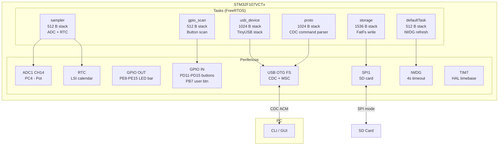
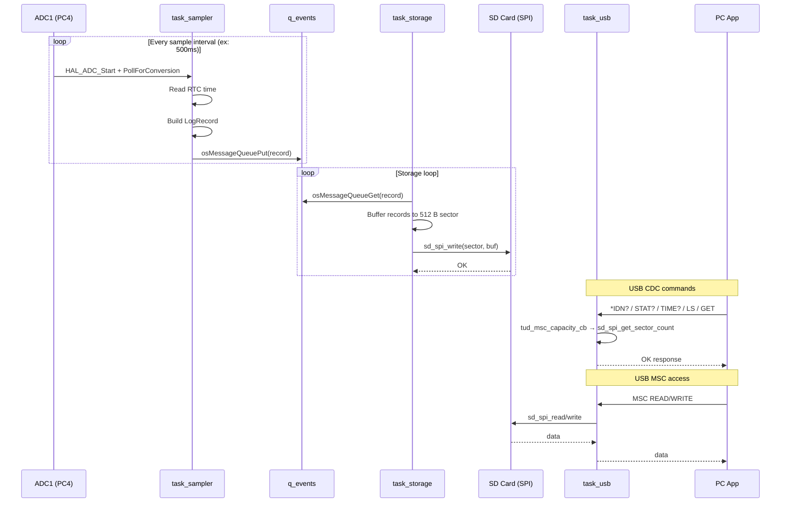

# STM32 Datalogger

STM32F107VCTx datalogger com FreeRTOS, TinyUSB (CDC + MSC) e SD card via SPI.

## Sistema

| Item | Especificação |
|---|---|
| **MCU** | STM32F107VCTx, Cortex-M3 @ 72 MHz |
| **Flash** | 256 KB |
| **RAM** | 64 KB (+ 4 KB heap FreeRTOS Heap4) |
| **RTOS** | FreeRTOS 10.0.1 via CMSIS-RTOS V2 |
| **HAL** | STM32Cube FW_F1 V1.8.5 |
| **USB** | TinyUSB, CDC + MSC composite device |
| **SD Card** | SPI mode, FatFs |
| **Toolchain** | GNU Tools for STM32 (arm-none-eabi-gcc 11.3.rel1) |
| **IDE** | STM32CubeIDE 1.14.1 |

## Arquitetura



## Fluxo de dados



## Pinagem

| Peripheral | Pin | Função |
|---|---|---|
| ADC1 CH14 | PC4 | Potenciômetro |
| RTC | — | Calendar (LSI) |
| GPIO OUT | PE8–PE15 | LED bar |
| GPIO IN | PD11–PD15 | BtnSelect, BtnUp, BtnRight, BtnDown, BtnLeft |
| GPIO IN | PB7 | BtnUser |
| SPI1 SCK | PA5 | SD card clock |
| SPI1 MISO | PA6 | SD card data out |
| SPI1 MOSI | PA7 | SD card data in |
| SPI1 CS | PB6 | SD card chip select |
| SWDIO | PA13 | Debug |
| SWCLK | PA14 | Debug |
| SWO | PB3 | Trace |
| USB DM | PA11 | USB D- |
| USB DP | PA12 | USB D+ |

## Build & Flash

```powershell
# Build
.\build.ps1 -Config Debug

# Flash (auto-detects J-Link or ST-Link)
.\flash.ps1 -Config Debug

# Debug
.\debug.ps1 -Config Debug
```

## App (PC Companion)

```bash
cd App
pip install -e .

# CLI
datalogger info
datalogger status
datalogger time --set
datalogger ls

# GUI
datalogger-gui
```

## Debug

LEDs diagnósticos no boot (PE8–PE15):

| LED | Significado |
|---|---|
| PE8 | CPU start (6x toggle) |
| PE9 | SystemClock_Config |
| PE10 | LSE setup |
| PE11 | Board init OK |
| PE12 | MX_GPIO_Init |
| PE13 | MX_ADC1_Init |
| PE14 | MX_RTC_Init |
| PE15 | MX_SPI1_Init |
